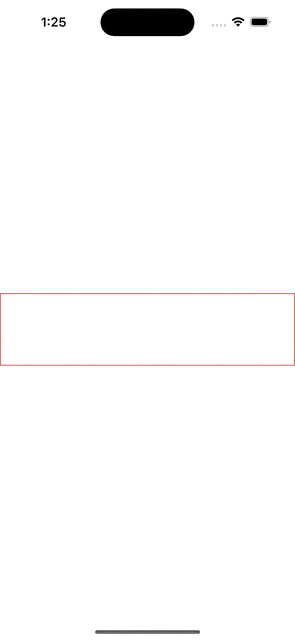

# AnimatingText

A simple SwiftUI View that animates text one character at a time.

## Setup

Add the following as a package in your Package.swift file or Xcode project:

```swift
git@github.com:rlziii/AnimatingText.git
```

Then simply `import AnimatingText` in a file that needs to use the `AnimatingText` SwiftUI `View`.

## Usage

A simple SwiftUI `View` that shows a use case is below.
The supplied text will start animating on appear.

```swift
import AnimatingText
import SwiftUI

struct ContentView: View {
  var body: some View {
    AnimatingText(
        text: "This is a pretty long string so it will probably take at least a few lines to display the whole thing.",
        textColor: .primary, // Optional; controls the color of the displayed text (default: Color.primary).
        interval: 0.05, // Optional; controls the time between each character displaying (default: 0.05).
        onFinished: { print("All done!") } // Optional; executes after the text is done animating (default: empty closure).
    )
    .padding()
    .border(.red)
  }
}
```

  
Example running on iPhone 14 Pro simulator.

## Minimum Supported Deployment Targets

iOS: `16.0`  
macOS: `12.0`

## License

MIT License. See `LICENSE` file for more details.
